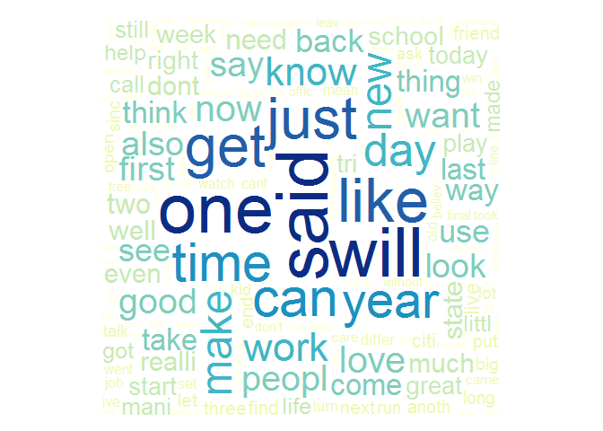

# Milestone Report - Data Science Specialization Capstone
David Waterman  

# Introduction

This project is part of the capstone of the Cousera Data Science Specialization provided by Johns Hopkins University and Swiftkey. The goal of the project is to develop a predictive text application in R that uses natural language processing to take a word or phrase as input and predict the next word in the phrase.

This milestone report explains the exploratory analysis of the data files provided, and summarizes plans for creating the prediction algorithm.


# Data Processing

The data set consists of four languages and three data files each. For this project we will use only the US English data files.

### Loading The Dataset 

```r
fileURL <- "http://d396qusza40orc.cloudfront.net/dsscapstone/dataset/Coursera-SwiftKey.zip"
download.file(fileURL, destfile = "Dataset.zip", method = "curl")
unlink(fileURL)
unzip("Dataset.zip")
```


### Creating a Sample

The provided data files are extremely large. In order to enable faster data processing, a sample was generated from each data file. The sample was saved to a separate file for fast reuse.


```r
sample_twitter <- twitter[sample(1:length(twitter),5000)]
sample_news <- news[sample(1:length(news),5000)]
sample_blogs <- blogs[sample(1:length(blogs),5000)]
text_sample <- c(sample_twitter,sample_news,sample_blogs)
```


# Summary Statistics


The following table shows a summary of the data files provided, and the sample file created.


File Name            File Size in Megabytes   Line Count   Word Count
------------------  -----------------------  -----------  -----------
Blogs                                200.42       899288     37334131
News                                 196.28        77259      2643969
Twitter                              159.36      2360148     30373583
Aggregated Sample                      2.40        15000        15000


The word cloud below displays the most common words in the sample file.


```r
trigramTDM <- TermDocumentMatrix(final_corpus)
wcloud <- as.matrix(trigramTDM)
v <- sort(rowSums(wcloud),decreasing=TRUE)
d <- data.frame(word = names(v),freq=v)
wordcloud(d$word,d$freq,
          c(5,.3),50,
          random.order=FALSE,
          colors=brewer.pal(8, "YlGnBu"))
```

<!-- -->


# Building A Text Corpus

The text in the sample is cleaned using the tm package. The following operations are performed to the text:

* Change all words to lowercase
* Remove punctuation
* Remove all numbers
* Remove URLs
* Remove stop words
* Remove profanity
* Remove stem words
* Remove all white space

After the cleanup, the text corpus is ready for processing.


```r
clean_sample <- tm_map(clean_sample,
                      content_transformer(function(x) 
                              iconv(x, to="UTF-8", sub="byte")))

# Change to all lowercase; and remove punction, numbers, URLs, stop, profanity,
# stem words, and blank space
clean_sample <- tm_map(clean_sample, content_transformer(tolower), lazy = TRUE)
clean_sample <- tm_map(clean_sample, content_transformer(removePunctuation))
clean_sample <- tm_map(clean_sample, content_transformer(removeNumbers))
removeURL <- function(x) gsub("http[[:alnum:]]*", "", x) 
clean_sample <- tm_map(clean_sample, content_transformer(removeURL))
clean_sample <- tm_map(clean_sample, stripWhitespace)
clean_sample <- tm_map(clean_sample, removeWords, stopwords("english"))
clean_sample <- tm_map(clean_sample, removeWords, profanity_words)
clean_sample <- tm_map(clean_sample, stemDocument)
clean_sample <- tm_map(clean_sample, stripWhitespace)
```


## N-Gram Tokenization

In Natural Language Processing (NLP) an n-gram is a contiguous sequence of n items from a given sequence of text or speech.

The following function is used to extract unigrams, bigrams and trigrams from the cleaned text corpus.


```r
ngramTokenizer <- function(corpus, ngram_count) {
        ngramFunction <- NGramTokenizer(corpus, 
                                Weka_control(min = ngram_count, max = ngram_count, 
                                delimiters = " \\r\\n\\t.,;:\"()?!"))
        ngramFunction <- data.frame(table(ngramFunction))
        ngramFunction <- ngramFunction[order(ngramFunction$Freq, 
                                             decreasing = TRUE),][1:10,]
        colnames(ngramFunction) <- c("String","Count")
        ngramFunction
}
```

Using the tokenizer function to analyze the sample, the top 10 most common unigrams, bigrams, and trigrams are displayed on the graphs below.

### Top Unigrams

```r
unigram <- readRDS("MilestoneReport/unigram.RDS")
unigram_plot <- gvisColumnChart(unigram, "String", "Count",                  
                            options=list(legend="none"))

print(unigram_plot, "chart")
```

<!-- ColumnChart generated in R 3.3.1 by googleVis 0.6.1 package -->
<!-- Sun Nov 27 18:46:56 2016 -->


<!-- jsHeader -->
<script type="text/javascript">
 
// jsData 
function gvisDataColumnChartIDca44c894fed () {
var data = new google.visualization.DataTable();
var datajson =
[
 [
"said",
1420
],
[
"one",
1363
],
[
"will",
1355
],
[
"like",
1190
],
[
"just",
1121
],
[
"get",
1109
],
[
"time",
1038
],
[
"can",
1023
],
[
"go",
998
],
[
"year",
976
] 
];
data.addColumn('string','String');
data.addColumn('number','Count');
data.addRows(datajson);
return(data);
}
 
// jsDrawChart
function drawChartColumnChartIDca44c894fed() {
var data = gvisDataColumnChartIDca44c894fed();
var options = {};
options["allowHtml"] = true;
options["legend"] = "none";

    var chart = new google.visualization.ColumnChart(
    document.getElementById('ColumnChartIDca44c894fed')
    );
    chart.draw(data,options);
    

}
  
 
// jsDisplayChart
(function() {
var pkgs = window.__gvisPackages = window.__gvisPackages || [];
var callbacks = window.__gvisCallbacks = window.__gvisCallbacks || [];
var chartid = "corechart";
  
// Manually see if chartid is in pkgs (not all browsers support Array.indexOf)
var i, newPackage = true;
for (i = 0; newPackage && i < pkgs.length; i++) {
if (pkgs[i] === chartid)
newPackage = false;
}
if (newPackage)
  pkgs.push(chartid);
  
// Add the drawChart function to the global list of callbacks
callbacks.push(drawChartColumnChartIDca44c894fed);
})();
function displayChartColumnChartIDca44c894fed() {
  var pkgs = window.__gvisPackages = window.__gvisPackages || [];
  var callbacks = window.__gvisCallbacks = window.__gvisCallbacks || [];
  window.clearTimeout(window.__gvisLoad);
  // The timeout is set to 100 because otherwise the container div we are
  // targeting might not be part of the document yet
  window.__gvisLoad = setTimeout(function() {
  var pkgCount = pkgs.length;
  google.load("visualization", "1", { packages:pkgs, callback: function() {
  if (pkgCount != pkgs.length) {
  // Race condition where another setTimeout call snuck in after us; if
  // that call added a package, we must not shift its callback
  return;
}
while (callbacks.length > 0)
callbacks.shift()();
} });
}, 100);
}
 
// jsFooter
</script>
 
<!-- jsChart -->  
<script type="text/javascript" src="https://www.google.com/jsapi?callback=displayChartColumnChartIDca44c894fed"></script>
 
<!-- divChart -->
  
<div id="ColumnChartIDca44c894fed" 
  style="width: 500; height: automatic;">
</div>

### Top Bigrams

```r
bigram <- readRDS("MilestoneReport/bigram.RDS")
bigram_plot <- gvisColumnChart(bigram, "String", "Count",                  
                            options=list(legend="none"))

print(bigram_plot, "chart")
```

<!-- ColumnChart generated in R 3.3.1 by googleVis 0.6.1 package -->
<!-- Sun Nov 27 18:46:56 2016 -->


<!-- jsHeader -->
<script type="text/javascript">
 
// jsData 
function gvisDataColumnChartIDca4208b257 () {
var data = new google.visualization.DataTable();
var datajson =
[
 [
"last year",
104
],
[
"high school",
88
],
[
"new york",
82
],
[
"year ago",
77
],
[
"right now",
75
],
[
"look like",
71
],
[
"feel like",
56
],
[
"make sure",
52
],
[
"new jersey",
51
],
[
"last week",
49
] 
];
data.addColumn('string','String');
data.addColumn('number','Count');
data.addRows(datajson);
return(data);
}
 
// jsDrawChart
function drawChartColumnChartIDca4208b257() {
var data = gvisDataColumnChartIDca4208b257();
var options = {};
options["allowHtml"] = true;
options["legend"] = "none";

    var chart = new google.visualization.ColumnChart(
    document.getElementById('ColumnChartIDca4208b257')
    );
    chart.draw(data,options);
    

}
  
 
// jsDisplayChart
(function() {
var pkgs = window.__gvisPackages = window.__gvisPackages || [];
var callbacks = window.__gvisCallbacks = window.__gvisCallbacks || [];
var chartid = "corechart";
  
// Manually see if chartid is in pkgs (not all browsers support Array.indexOf)
var i, newPackage = true;
for (i = 0; newPackage && i < pkgs.length; i++) {
if (pkgs[i] === chartid)
newPackage = false;
}
if (newPackage)
  pkgs.push(chartid);
  
// Add the drawChart function to the global list of callbacks
callbacks.push(drawChartColumnChartIDca4208b257);
})();
function displayChartColumnChartIDca4208b257() {
  var pkgs = window.__gvisPackages = window.__gvisPackages || [];
  var callbacks = window.__gvisCallbacks = window.__gvisCallbacks || [];
  window.clearTimeout(window.__gvisLoad);
  // The timeout is set to 100 because otherwise the container div we are
  // targeting might not be part of the document yet
  window.__gvisLoad = setTimeout(function() {
  var pkgCount = pkgs.length;
  google.load("visualization", "1", { packages:pkgs, callback: function() {
  if (pkgCount != pkgs.length) {
  // Race condition where another setTimeout call snuck in after us; if
  // that call added a package, we must not shift its callback
  return;
}
while (callbacks.length > 0)
callbacks.shift()();
} });
}, 100);
}
 
// jsFooter
</script>
 
<!-- jsChart -->  
<script type="text/javascript" src="https://www.google.com/jsapi?callback=displayChartColumnChartIDca4208b257"></script>
 
<!-- divChart -->
  
<div id="ColumnChartIDca4208b257" 
  style="width: 500; height: automatic;">
</div>

### Top Trigrams

```r
trigram <- readRDS("MilestoneReport/trigram.RDS")
trigram_plot <- gvisColumnChart(trigram, "String", "Count",                  
                            options=list(legend="none"))

print(trigram_plot, "chart")
```

<!-- ColumnChart generated in R 3.3.1 by googleVis 0.6.1 package -->
<!-- Sun Nov 27 18:46:56 2016 -->


<!-- jsHeader -->
<script type="text/javascript">
 
// jsData 
function gvisDataColumnChartIDca4451d5940 () {
var data = new google.visualization.DataTable();
var datajson =
[
 [
"presid barack obama",
12
],
[
"happi mother day",
9
],
[
"st loui counti",
9
],
[
"happi new year",
8
],
[
"let us know",
8
],
[
"cant wait see",
7
],
[
"chief financi offic",
7
],
[
"first time sinc",
7
],
[
"nation weather servic",
7
],
[
"new york citi",
7
] 
];
data.addColumn('string','String');
data.addColumn('number','Count');
data.addRows(datajson);
return(data);
}
 
// jsDrawChart
function drawChartColumnChartIDca4451d5940() {
var data = gvisDataColumnChartIDca4451d5940();
var options = {};
options["allowHtml"] = true;
options["legend"] = "none";

    var chart = new google.visualization.ColumnChart(
    document.getElementById('ColumnChartIDca4451d5940')
    );
    chart.draw(data,options);
    

}
  
 
// jsDisplayChart
(function() {
var pkgs = window.__gvisPackages = window.__gvisPackages || [];
var callbacks = window.__gvisCallbacks = window.__gvisCallbacks || [];
var chartid = "corechart";
  
// Manually see if chartid is in pkgs (not all browsers support Array.indexOf)
var i, newPackage = true;
for (i = 0; newPackage && i < pkgs.length; i++) {
if (pkgs[i] === chartid)
newPackage = false;
}
if (newPackage)
  pkgs.push(chartid);
  
// Add the drawChart function to the global list of callbacks
callbacks.push(drawChartColumnChartIDca4451d5940);
})();
function displayChartColumnChartIDca4451d5940() {
  var pkgs = window.__gvisPackages = window.__gvisPackages || [];
  var callbacks = window.__gvisCallbacks = window.__gvisCallbacks || [];
  window.clearTimeout(window.__gvisLoad);
  // The timeout is set to 100 because otherwise the container div we are
  // targeting might not be part of the document yet
  window.__gvisLoad = setTimeout(function() {
  var pkgCount = pkgs.length;
  google.load("visualization", "1", { packages:pkgs, callback: function() {
  if (pkgCount != pkgs.length) {
  // Race condition where another setTimeout call snuck in after us; if
  // that call added a package, we must not shift its callback
  return;
}
while (callbacks.length > 0)
callbacks.shift()();
} });
}, 100);
}
 
// jsFooter
</script>
 
<!-- jsChart -->  
<script type="text/javascript" src="https://www.google.com/jsapi?callback=displayChartColumnChartIDca4451d5940"></script>
 
<!-- divChart -->
  
<div id="ColumnChartIDca4451d5940" 
  style="width: 500; height: automatic;">
</div>


# Interesting Findings

+ The data files provided are very large. In total they contain over 70,000,000 words. The computer used to generate this report would generate errors in some functions when the sample size exceeded 20,000 words. Processing the data is very time consuming. The final application will need to address this issue.

+ There are some unexpected abbreviations and misspellings showing up in the data. The text mining algorithm would ideally make accommodations for the most common of these.

+ As of this report, stop words have been removed from the corpus. Stop words are words that generally do not contain significance and are filtered out. Stop words lists generally contain articles, prepositions, and words so common as to have no processing value, such as the, and, it, to, and on. However for the purposes of next word prediction stop words are necessary as many phrases contain stop words. The application should allow stop words in its text prediction.

# Next Steps For The Prediction Application

The next step of the capstone project is to create a prediction application. The application must be fast enough to be usable without noticeable lag to the user, and small enough to be used from a mobile device without hogging resources. 

I will need to find a way to make use of the large data provided but keep the final application light. This likely means doing as much processing ahead of runtime for the user as possible. It would also be beneficial to increase the maximum n-gram length for more accurate phrase prediction. 

Finally, this will all need to be executed in a Shiny webapp for the final presentation. The final application will have a simple frontend that prompts the user to enter text, and then displays the predicted next word below. I would also like to have an option that enables displaying the top 3 choices for the next word, although that is not required by the project.
