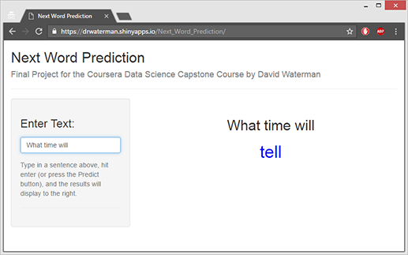

Coursera Data Science Specialization: Capstone Final Project
========================================================
author: David Waterman
transition: rotate

Presented by Coursera and Johns Hopkins University

Assignment
========================================================
This presentation is a brief pitch of a web application: [https://drwaterman.shinyapps.io/Next_Word_Prediction/](https://drwaterman.shinyapps.io/Next_Word_Prediction/), developed in the R programming language and deployed on the Shiny platform that predicts the next word based on an inputted word or phrase.

The application is the final project in the Capstone course of the Coursera Data Science Specialization presented by Johns Hopkins University.

The application was developed using the required [HC Corpora](http://www.corpora.heliohost.org/)   as the original text data source. Over the course of the project, this data was prepared, analyzed, cleaned, and processed into a predictive model that was fast and lightweight.

The Methods & Models
========================================================

The original data set was sampled to a reasonable size, and basic data cleaning was done to parse the text into a standardized lowercase format with no punctuation or special characters.

This cleaned data was then tokenized into n-grams (word groups) that could be mapped by how frequently they occurred. The frequency matrices for the n-grams were then transferred into frequency dictionaries, which became the basis for the prediction application.

When a user inputs a word or phrase into the app, the input is looked up in the frequency dictionary and the most likely next word is returned.

The Usage Of The Application
========================================================

This application was designed for mobile and small-screen use. As the user enters text, the app automatically updates the output side of the screen and displays the phrase entered with the predicted word below highlighted in blue.

Further Development
========================================================
Further development could improve on current weaknesses:
* The app was trained on data that came largely from blogs and twitter, and as a result the language usage and grammar are not what most people would expect or prefer.

* The algorithm currently only uses a maximum of 4-word phrases for prediction, which results in loss of context when the user is entering a complete idea or sentence.

* The text sample taken from the original data was made fairly small to enable reasonable processing time for the scope of this project. With more computing power or a longer deadline, more data could be analyzed to improve the range and depth of predicted phrases.
